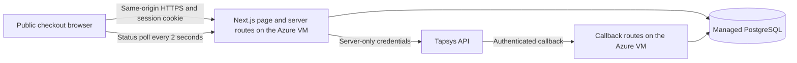
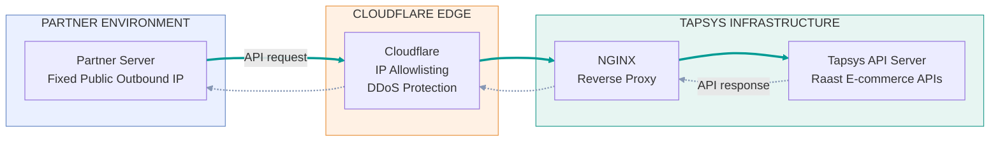
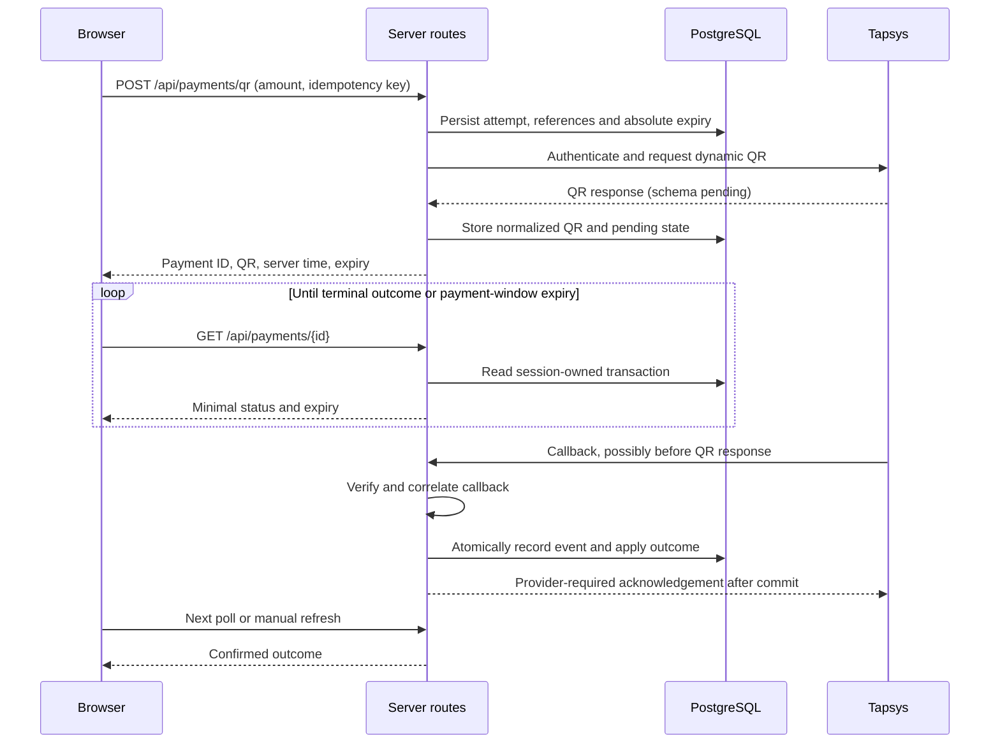
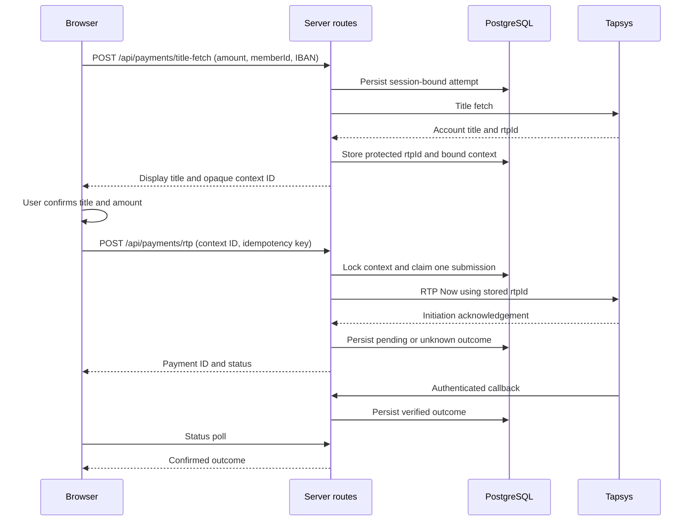

# RAAST E-commerce Demo — Software Design

Status: v0.1.0 design, updated 1 October 2026. The simulation is implemented; provider-facing live behavior below remains proposed. See [deployment guide](deployment.md) for the released simulation behavior and operational scope. Provider evidence and unresolved contracts are tracked in the [API inventory](provider-api-contract.md).

## 1. Purpose and scope

Provide a public, amount-driven payment page for one server-configured merchant. Visitors choose Dynamic QR or Request to Pay (RTP), initiate a PKR payment, and see authoritative callback-driven success or failure. No customer account registration is required; secure anonymous browser sessions isolate payment attempts.

The initial documentation delivery is complete. This release implements Next.js with TypeScript, server-side route handlers on the Azure VM, and PostgreSQL in an isolated Compose project. Static QR is reference documentation only. Shopping carts, inventory, merchant onboarding, refunds, settlement reporting, and a public general-purpose provider API proxy are outside the demo scope.

Application defaults: PKR 1–100 inclusive; QR lifetime 120 seconds; browser polling every two seconds; five initiation attempts per minute for each session and each IP. These are configurable application limits, not asserted provider capabilities.

## 2. Architecture and trust boundaries

- **Browser:** amount and payer input, account-title confirmation, QR rendering, countdown, and status display. Never receives provider credentials, bearer tokens, `rtpId`, or raw provider responses.
- **Server routes:** input validation, session ownership, idempotency, limits, provider request construction, and normalized response delivery. Merchant and till/terminal values come from server configuration, not visitor input.
- **Provider adapter:** isolates authentication, request mapping, QR normalization, title-fetch parsing, RTP submission, callback verification, and status translation. Live and mock adapters use explicit environment configuration; failures never silently fall back to mock success.
- **Database:** authoritative transaction state, context, callback deduplication, idempotency, and distributed rate counters. Do not store authoritative state in function memory or local filesystem.
- **Secrets:** local ignored environment files or Vercel server-only environment variables. No `NEXT_PUBLIC_` secret variables. Preview deployments use separate mock/test configuration and database isolation.

Use short HTTP requests and persisted state, not a function held open for the 120-second countdown. PostgreSQL connections use a provider-supported pooled connection string. No WebSocket service or durable background worker is required for the first implementation.

### Merchant connectivity and deployment model

This merchant-facing view shows the partner-to-Tapsys network path from the supplied reference image, `1001217925.png` ("Raast E-commerce API Integration"). It complements the application architecture above.

- **Merchant requirement:** share the server's **fixed public outbound IP** with Tapsys for Cloudflare allowlisting.
- **Arrow legend:** solid arrows represent API requests; dashed arrows represent API responses returning along the same path.
- **Payment callbacks:** the responses shown here are distinct from asynchronous payment callbacks, which remain covered by the application and checkout diagrams.
- **Evidence boundary:** this topology comes from the supplied reference image; actual deployment and connectivity have not been independently verified.
- **Azure VM deployment:** the outbound connectivity configuration must satisfy this fixed-IP requirement before live integration. IP provisioning, Tapsys allowlist registration, and connectivity testing remain outstanding under [dependency P10](provider-api-contract.md#provider-clarification-checklist).

## 3. Checkout journeys

### 3.1 Dynamic QR

1. Visitor selects QR and enters a decimal PKR amount. Parse as a decimal string into integer paisa; reject nonpositive amounts, scientific notation, nonnumeric input, excess fractional digits, and configured limit violations. Never use binary floating-point arithmetic for money.
2. Validate session, same-origin request and limits; persist the attempt and references before contacting the provider. Set server-created expiry to creation time plus 120 seconds.
3. Submit the provider request with correctly converted amount and confirmed timezone format. Provider units and formatting remain integration prerequisites.
4. Normalize the verified QR response to QR text rendered by a trusted encoder, or validated image content served from the application. Never inject provider HTML/SVG markup or blindly fetch arbitrary provider-supplied URLs. The supplied response establishes `info.qrString`; use this text with a trusted QR encoder. `info.qrImage` is also supplied, but the sample image content appears abbreviated.
5. Return remaining lifetime using server time and absolute expiry; provider latency reduces the display window. Do not restart the countdown on browser reload. If already expired, do not display the QR as payable. If the provider returns an earlier expiry, use the earlier confirmed expiry.
6. Poll while pending and before expiry; prevent overlapping requests, pause while hidden, and refresh immediately on visibility return. Transient status errors use capped backoff up to ten seconds, then resume the normal interval after recovery. Do not interpret a network error as payment failure.
7. At expiry, hide the QR and stop automatic polling. Display “Payment window expired—confirmation pending” if unresolved, offer manual status refresh and a deliberate new-attempt action. Warn that a new attempt does not cancel the old payment. Continue accepting verified late callbacks.

### 3.2 Request to Pay

The user confirms the title-fetch linkage, and newer supplied payloads establish `info.rtpId` and `customerDetails.accountTitle`. Identifier lifetime and reuse remain unverified. The server retains that identifier and sends only an opaque context ID to the browser alongside the display title, amount and masked payer reference.

Bind the context to the originating session, attempt, normalized amount, currency and payer selection. Amount or payer changes invalidate the context and require a new title fetch. Missing title or identifier prevents confirmation and RTP submission. A local maximum context age of five minutes is proposed; use a shorter confirmed provider lifetime where applicable. This local maximum does not establish provider validity.

Claim context consumption atomically to prevent concurrent RTP calls. An ambiguous provider timeout consumes the context for automatic retry purposes and leaves the attempt unresolved. Do not reuse it to create another payment automatically. Never accept browser-supplied `rtpId`, merchant data or raw provider request fields.

RTP has no demonstrated 120-second provider expiry. Poll for up to two minutes after submission for user convenience, then show confirmation pending with manual refresh; this is a UI waiting period, not payment expiry. The provider-specific RTP fields described in P07 must be resolved before enabling live RTP.

## 4. Proposed application API

These interfaces are application-owned designs and are not claims about provider schemas. JSON responses use `Cache-Control: no-store`. The initial page establishes a random signed session cookie with `HttpOnly`, `Secure` in deployed environments, `SameSite=Lax`, and a 24-hour lifetime. Payment status access is limited to that session.

All browser POSTs require a same-origin check and `Idempotency-Key`. Reject missing or untrusted origin. Webhooks do not use browser session authentication; they use the provider-confirmed verification mechanism. Apply request size limits (16 KiB for browser JSON; initially 64 KiB for callbacks, revisited against provider samples).

| Endpoint | Input | Normalized successful output |
|---|---|---|
| `POST /api/payments/qr` | `amountPkr`: decimal string | `paymentId`, `status`, `qr` display descriptor, `expiresAt`, `serverTime` |
| `POST /api/payments/title-fetch` | `amountPkr`, `memberId`, `iban` | `paymentId`, `contextId`, `accountTitle`, masked payer reference, amount, `contextExpiresAt` |
| `POST /api/payments/rtp` | `contextId` | `paymentId`, `status`, `serverTime` |
| `GET /api/payments/{id}` | Opaque application payment ID | `paymentId`, `flow`, `amountPaisa`, `currency`, `status`, `windowExpired`, `expiresAt` if applicable, `updatedAt`, `serverTime`; unexpired QR display descriptor for reload recovery |
| `POST /api/webhooks/tapsys/payment-notification` | Supplied payment-notification shape; verification headers pending | Observed camelCase `responseCode`/`responseDesc` and `info`; reference echo and HTTP contract pending |
| `POST /api/webhooks/tapsys/notify-merchant` | Supplied notify-merchant shape; verification headers pending | Observed camelCase `responseCode`/`responseDesc` and `info`; HTTP contract pending |

For new browser operations use 201 for completed creation, 202 for pending/ambiguous initiation, and 200 for status reads or a safe idempotent replay. Use 400 for malformed input, 403 for invalid origin/session, 404 for absent or foreign-session payment/context, 409 for incompatible idempotency reuse or consumed/expired context, 429 for limits, 502 for unusable provider responses, and 503 when live mode is unavailable. Errors expose a stable application error code, safe message and request ID, never provider credentials or raw payloads. Once provider acceptance is uncertain, return the persisted payment ID with an unresolved status rather than an error inviting resubmission.

Enforce idempotency by a database uniqueness constraint on session, operation and key with a normalized request fingerprint. Same-key/same-input replays return the existing attempt; different input returns 409. Store sufficient normalized result information to replay safely. A replay does not create a provider call. Distinct keys do not bypass the atomic RTP context claim.

## 5. Persistence and transaction state

Use migrations in the later implementation; none are executed in this pass.

| Entity | Minimum persisted information |
|---|---|
| Payment attempt | Random ID, session ownership hash, environment/mode, flow, integer amount in paisa, PKR currency, creation/update/expiry times, status, version, merchant reference, STAN/RRN/reference ID and returned provider correlation IDs |
| Title-fetch context | Random ID, attempt/session binding, protected `rtpId`, minimum title/payer data, expiry, consumption state and claimed submission ID |
| Callback event | Provider event ID or contract-supported deduplication key, environment, correlated payment, normalized result, receipt time, verification outcome and processing disposition |
| Idempotency record | Session/operation/key, request fingerprint, payment/context link and safe normalized replay result |
| Rate counter | Session or trusted client-IP hash, operation category, time bucket and count |

Use database uniqueness constraints for references and idempotency plus transactional compare-and-set/row locks for context claims and outcome changes. Generate references server-side according to provider-confirmed length and uniqueness rules; reserve them before sending. Store UTC timestamps internally and convert only at the provider boundary.

Separate payment outcome from UI timeout:

| State | Meaning and allowed progression |
|---|---|
| `CREATED` | Persisted before the provider operation; moves to `PENDING`, `INITIATION_FAILED`, `UNKNOWN`, or directly to a verified final outcome. |
| `AWAITING_CONFIRMATION` | Title fetched, awaiting visitor confirmation; moves to `CREATED` on atomic RTP claim or `ABANDONED` if unused context expires. |
| `PENDING` | Initiation accepted, outcome unconfirmed; moves to verified `SUCCEEDED`/`FAILED` or remains pending. |
| `UNKNOWN` | Initiation may have reached provider, but response is ambiguous; resolves only through authoritative provider evidence. |
| `INITIATION_FAILED` | Definitive initiation rejection before accepted payment; distinct from a failed payment. |
| `SUCCEEDED` / `FAILED` | Provider-confirmed payment result under the agreed status contract. Conflicting final events are flagged for reconciliation instead of overwriting. |
| `ABANDONED` | Unsubmitted, expired title-fetch context; no payment was initiated. |

`windowExpired` is a derived display flag, not a terminal payment state. A verified callback can arrive before the initiation response; the later response must not downgrade a final outcome. Unexpected callbacks against rejected/abandoned attempts are quarantined for reconciliation.

Avoid long database transactions across external HTTP calls: persist intent and claim work, commit, call the provider, then conditionally update. If the function stops after submission, the stored attempt remains unresolved and must not trigger automatic resubmission. The status view treats stale initiation as unresolved. No durable recovery worker is assumed.

Suggested demo retention: session access 24 hours; unused title-fetch contexts at most five minutes; redact/delete title and `rtpId` within 24 hours after submission or context expiry; retain normalized payment/event audit metadata for 30 days and then purge. These are proposed operational defaults, subject to the operator's actual retention requirements. Later implementation must provide a protected daily cleanup job and preserve unresolved reconciliation records until resolved. Do not persist full IBAN after title-fetch processing unless a verified provider requirement makes it necessary; protect any temporary retention.

## 6. Callback processing and reconciliation

The [supplied payload evidence](provider-payload-evidence.md) establishes two distinct event shapes. Register the two proposed application callback URLs above with Tapsys; its sample `/paymentNotification` and `/notifyMerchant` paths do not establish mandatory deployed paths. Use a shared processor with an explicit event type. Payment notification has no status field; notify merchant shows only `RTP Accepted`. Neither is mapped to final success until provider semantics are confirmed. Receiver `responseDesc: "SUCCESS"` acknowledges processing, not payment completion. The samples reuse a message ID across event types: do not deduplicate on message ID alone without a provider guarantee.

1. Read the exact raw body where required by the provider signature scheme. Apply payload limits and provider-supported authentication/replay checks before business processing. Do not invent a signature algorithm or treat an obscure URL as authentication.
2. Parse using the confirmed schema; map status using an explicit allowlist. Unknown statuses cannot mark payments final.
3. Correlate by verified provider references to the correct environment and configured merchant. Compare amount/currency when present. No amount-only matching and no matching solely from untrusted customer input.
4. Under one database transaction, deduplicate the event, lock the payment, validate transition and persist the normalized result. A duplicate verified event is a successful no-op.
5. Acknowledge only after durable storage. A storage failure must allow provider retry under its agreed contract. Retain verified unmatched/conflicting events minimally for reconciliation without updating an unrelated payment; the precise acknowledgement behavior is a P05 dependency.

Do not expose a public arbitrary-status update endpoint. Mock callbacks run only in isolated non-live mode and cannot affect live records. Without the provider verification contract, the live callback handler fails closed and live initiation remains disabled.

There is no supplied provider status enquiry API. Missing callbacks and ambiguous outcomes remain pending/unknown, with operational review using request and provider references. Do not claim automated reconciliation, confirmed settlement, or refund capability. Future reversal events require an explicit contract and state-model extension.

## 7. Public access, limits and secrets

Public live mode uses the configured merchant's credentials; visitors are not issued API credentials. Show merchant identity, PKR amount and a clear live-payment indicator before submission. Do not enable live calls merely because credentials are present: require a separate live-enable flag and completed integration gates.

Validate PKR values server-side, enforce inclusive 100–10000 paisa defaults, and refuse arbitrary currencies. Atomic persistent fixed-minute counters enforce five new QR/RTP initiation attempts per session and per trusted platform-derived IP; both limits apply. Same-key replays use the existing operation rather than another provider initiation. Give title fetch its own five-per-minute per-session/per-IP limit to reduce payer enumeration. Shared-network effects are acceptable for this demo; IP limits are a control, not proof of identity. Store keyed hashes instead of raw IP addresses where practical.

Require HTTPS, same-origin mutation requests, session ownership checks and no wildcard CORS. Return only masked payer references and safe application messages. Status responses must not leak account titles or provider IDs to another session. Keep QR representations scoped to their transaction and expiry.

`.gitignore` excludes local secrets, Postman exports and logs. A content scan and staged-diff review remain mandatory because ignored filenames do not prevent secrets inside tracked Markdown or code. `.env.example` contains placeholders only. Use Vercel sensitive environment variables for secrets and separate production/preview configuration. Review deployed browser assets and error logs for accidental exposure in the implementation phase.

## 8. Deployment and operations design

The simulation deployment uses a locally built image transferred over SSH, the existing Apache/NGINX host, and PostgreSQL with data under `/backupfiles/raastdemo`. Apply reviewed migrations and restricted environment configuration. Use a stable production origin for provider callback registration; preview URLs must not become live callback destinations.

Deployment sequence: validate mock behavior and tests; obtain provider contracts and approved connectivity; configure isolated integration credentials; register and verify callbacks; exercise both real flows with permitted test transactions; verify public limits and secret isolation; explicitly enable live initiation. Provider allowlisting or network restrictions must be checked before choosing final Azure outbound connectivity settings.

Monitor initiation errors/timeouts, invalid callbacks, duplicate/unmatched/conflicting events, unresolved attempts, database errors, and rate-limit hits. Logs carry application request IDs and safe transaction references, not tokens, full IBANs or raw payloads. Manual operational review is sufficient for initial reconciliation; no admin dashboard is promised.

Rollback disables new live initiation while retaining the callback route, database and status reads for in-flight attempts. Roll back application deployments only with schema compatibility checked. Never remove callback acceptance merely because the public page is disabled.

Platform references: [Vercel Functions](https://vercel.com/docs/functions), [environment variables](https://vercel.com/docs/environment-variables), and [sensitive environment variables](https://vercel.com/docs/environment-variables/sensitive-environment-variables). These describe platform capabilities, not verification of this project's deployment.

## 9. Acceptance and verification plan

The following matrix defines the full live-integration acceptance scope. The release record distinguishes executed simulation tests from unexecuted provider integration checks.

| Scenario | Required result |
|---|---|
| Valid amount and limits | PKR 1 and 100 accepted; out-of-range, negative, nonnumeric and excess-precision values rejected before provider calls. |
| QR success path | One persisted attempt; verified QR displayed; absolute 120-second expiry and provider latency handled correctly. |
| QR reload/clock skew | Same session restores remaining time using server time; reload never resets lifetime. |
| QR expiry | QR hidden; no automatic failed-payment classification; manual refresh remains available. |
| Late callback | Verified late success updates the expired-window attempt. |
| Title-fetch handoff | `info.rtpId` is stored server-side and sent as `paymentDetails.rtpId`; display `customerDetails.accountTitle`; preserve the exact returned identifier. |
| Supplied response contracts | Parse snake_case API success fields and camelCase callback acknowledgements distinctly; time-only token expiry is not treated as an absolute timestamp. |
| Callback type semantics | Keep notification types distinct even with a reused message ID; `RTP Accepted` cannot mark paid; reject assumed reference transformations. |
| Missing/expired title context | No RTP call; user refetches title; changed amount/payer requires new context. |
| Context theft/concurrency | Foreign session cannot use context; concurrent submissions result in at most one provider call. |
| Idempotency | Same key and input replay existing attempt; different input conflicts; page double-click cannot create duplicate submission. |
| Provider timeout/function interruption | Persist unknown outcome; do not auto-resubmit or claim failure. |
| Provider rejection/malformed reply | Safe error or unresolved state; no invented title/QR/success. |
| Callback authentication/replay | Invalid or unverifiable event cannot change transaction; provider test vectors verify genuine events. |
| Duplicate/early/out-of-order callbacks | Idempotent application; early final event survives later initiation response. |
| Conflicting/unknown/unmatched event | No incorrect transition; minimal evidence retained for reconciliation. |
| Database failure at callback | No premature success acknowledgement; safe retry per provider contract. |
| Status polling and ownership | Two-second normal cadence; backoff on errors; no overlapping polls; foreign session gets 404. |
| RTP UI wait expiry | Show pending, not provider expiry or failure; manual refresh available. |
| Rate limits | Atomic limits hold across multiple function instances; session/IP and title-fetch controls exercised. |
| Secret isolation | Browser assets, API errors, logs and tracked files contain no credentials or full payer IBAN. |
| Mode separation | Mock configuration and events cannot update live transactions; previews have no live credentials. |
| Rollback/cleanup | New initiations disabled while callbacks/status work; retention cleanup preserves unresolved records. |

Documentation-pass checks: Markdown links resolve, JSON examples parse, placeholders replace source credentials/identifiers, ignore rules protect representative sensitive paths, staged content is scanned, GitHub visibility is private, and pushed `main` matches the reviewed local commit. Passing these checks does not validate provider integration.

## 10. Open dependencies and decisions

Accepted decisions: private GitHub repository, public eventual live demo, one configured merchant, QR and RTP, Next.js/TypeScript/Azure VM, PostgreSQL, browser polling, server-only credentials, default amount/rate limits, and documentation before implementation.

Provider checklist P01–P10 remains the source of live integration blockers. In particular, response parsing, callback verification/status mapping, amount units, timezone, reference rules, and RTP ancillary fields need evidence. The `rtpId` origin and exact field path are resolved by user confirmation and supplied payloads; lifecycle remains unresolved. The newer RTP request uses v2 while the original collection uses v1; resolve that discrepancy before selecting a live path. Vendor selection for managed PostgreSQL and actual Vercel provisioning are later deployment decisions; neither is needed to complete or verify this documentation pass.
